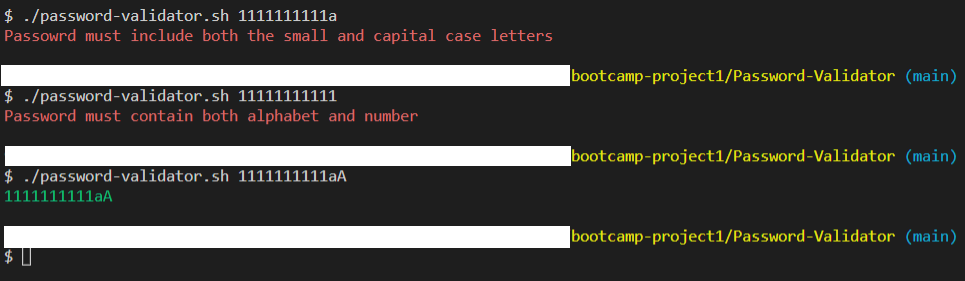
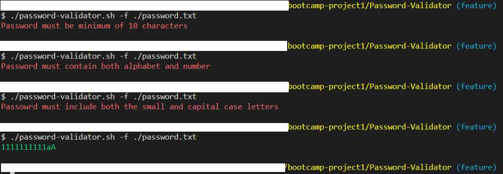

# Password Validator :]

Password Validator is a bash script that checks the follow requirements for the password:

* Length – minimum of 10 characters.
* Contain both alphabet and number.
* Include both the small and capital case letters.

## Example

## Feature update

Now it is available to read the password from the file and check it by the same requirements.

## Example 

